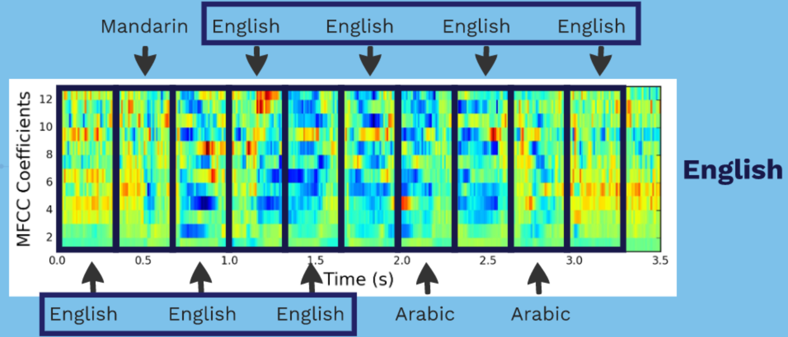

# Native Language Classification

## Overview

Using audio samples from [The Speech Accent Archive](http://accent.gmu.edu/), I wanted to show that a deep neural network can classify the native language of a speaker.


## Table of Contents
1. [Dependencies](https://github.com/srbecerra/DialectDetect/blob/master/README.md#dependencies)
2. [Motivation](https://github.com/srbecerra/DialectDetect/blob/master/README.md#motivation)
3. [Data](https://github.com/srbecerra/DialectDetect/blob/master/README.md#data)
4. [Model](https://github.com/srbecerra/DialectDetect/blob/master/README.md#model)
5. [Running Model](https://github.com/srbecerra/DialectDetect/blob/master/README.md#running-model)
6. [Performance](https://github.com/srbecerra/DialectDetect/blob/master/README.md#performance)

## Dependencies
  * [Python 2.7](https://www.python.org/download/releases/2.7/)
  * [Keras](https://keras.io/)
  * [Numpy](http://www.numpy.org/)
  * [BeautifulSoup](https://www.crummy.com/software/BeautifulSoup/)
  * [Pydub](https://github.com/jiaaro/pydub)
  * [Sklearn](http://scikit-learn.org/stable/)
  * [Librosa](http://librosa.github.io/librosa/)

## Data
I started with the data from The Speech Accent Archive, a collection of 2447 audio samples from people for over 300 countries speaking the same English paragraph. The paragraph contains most of the consonants, vowels, and clusters of standard American English. It wasn’t useful to use the 9 audio samples from Finland.

For the purpose of this project, I focused on countries with the most abundant audio samples, and the languages that have distinctly different origins. I chose to work with English, Arabic, and Mandarin. After some filtering and to maintain a balanced dataset, I could only use 73 audio samples from each of the three languages.

## Model
Converted wav audio files into Mel Frequency Cepstral Coefficients graph.


The MFCC was fed into a 2 Dimensional Convolutional Neural Network (CNN) to predict the native language class.


    * Graph is for illustration purposes only.

## Challenges & Solutions
* Computationally expensive
  * Created an Amazon Web Services Elastic Compute Cloud (EC2) instance that allowed for splitting workload over 32 cores.
* Small dataset
  * MFCCs were sliced into smaller segments. These smaller segments were fed into the neural network where predictions were made. Using an ensembling method, a majority vote was taken to predict the native language class.


## Running Model
```  
  ├── README.md  
  ├── src   
  │     ├── accuracy.py
  |     ├── fromwebsite.py
  |     ├── getaudio.py
  │     ├── getsplit.py
  |     ├── trainmodel.py
  ├── models  
  │     ├── cnn_model138.h5
  ├── logs  
  │     ├── events.out.tfevents.1506987325.ip-172-31-47-225
  └── audio
```

###### To download language metadata from [The Speech Accent Archive](http://accent.gmu.edu/index.php) and download audio files:
1. Run fromwebsite.py to get language metadata and save data to bio_metadata.csv

Example:

`python fromwebsite.py bio_metadata.csv mandarin english arabic`

2. Run getaudio.py to download audio files to the audio directory. All audio files listed in bio_metadata.csv will be downloaded.

Example:

`python GetAudio.py bio_metadata.csv`

###### To filter audio samples to feed into the CNN:
1. Edit the filter_df method in getsplit.py
    * This will filter audio files from bio_metadata.csv when calling trainmodel.py

###### To make predictions on audio files:
1. Run trainmodel.py to train the CNN

Example:

`python trainmodel.py bio_metadata.csv model50`

  * Running trainmodel.py will save the trained model as model50.h5 in the model directory and output the results to the console.
  * This script will also save a TensorBoard log file into the logs directory.


## Performance
Depending on how many languages you use and parameter tweaking, the number of training MFCC segments can vary. During the training of my model, I had roughly 6500 training MFCC segments and validated my results on 44 unsegmented audio files.

## Performance
With the three language classification, the model was able to predict the correct native language around 85% accuracy when given an English sample, 57% accuracy when given an Arabic sample, and an 87% when given a Mandarin sample.

|Act/Pred|English|Arabic|Mandarin|
|:-:|:-:|:-:|:-:|
|**English**|12|1|1|
|**Arabic**|1|8|5|
|**Mandarin**|1|1|14|
